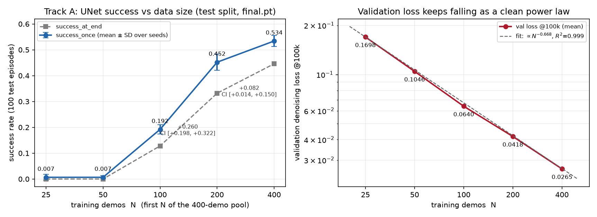
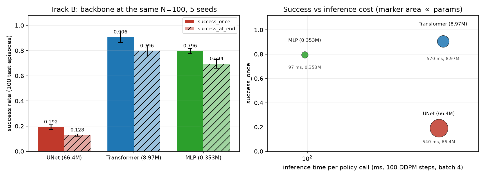
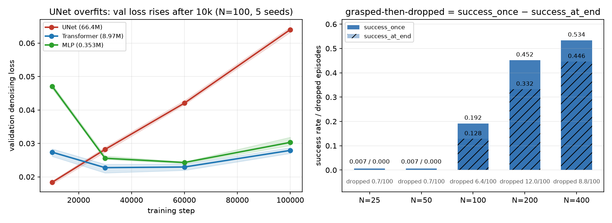

# PickCube：数据量（轨道 A）与主干（轨道 B）正式结果

负责任务：Task 1 / `TASK=pickcube`。本文只报告**测试种子**（10000–10099，100 回合）上的
闭环成功率，checkpoint 一律取 `final.pt`（100k 步）。

## 0. 摘要（TL;DR）

1. **数据量**：UNet 的成功率随示范条数单调上升，**0.7% → 0.7% → 19.2% → 45.2% → 53.4%**
   （N = 25 / 50 / 100 / 200 / 400），每一档的提升 bootstrap 区间都不含 0，
   但边际收益明显递减（100→200 是 +26.0 个百分点，200→400 只有 +8.2）。
2. **主干**：在同样的 N=100 上，**Transformer 0.906 ± 0.041**、**MLP 0.796 ± 0.019**，
   而官方 1D UNet 只有 **0.192 ± 0.018**。配对 bootstrap 差值
   `+0.714 [+0.656, +0.768]` 和 `+0.604 [+0.550, +0.656]`，两个区间都远离 0。
3. **原因可解释，不是评测错误**：UNet 是唯一把训练集背到近零（train loss ≈ 5e-4）、
   验证去噪 loss 从 10k 步起单调恶化（0.018 → 0.064）的主干；Transformer / MLP 的
   验证 loss 同期保持在 0.028–0.030。验证 loss 与成功率的排序完全一致。
4. **效率**：MLP 以 **1/188 的参数量**、**2.3× 更快的训练**、**5.6× 更快的单次推理**，
   拿到比 UNet 高 0.604 的成功率。Transformer 训练耗时与 UNet 相当、显存低 42%。
5. 因此「数据不够」这条结论只覆盖 UNet（轨道 A 按计划只用 UNet）；作为**跨轨道的观察**
   （非预注册结论）：同一 N=100 上换主干（Transformer 0.906）比把 UNet 从 100 补到 400
   （0.534）更划算。
6. **N=400 已补测**（`data_size_optional400`，训练 135937 / 评估 136012）：成功率升到
   **0.534 ± 0.021**，但最后一次翻倍只涨 +8.2 个百分点（100→200 是 +26.0），
   边际收益快速递减；与此同时验证 loss 仍严格按 **每翻倍 ×0.63** 的幂律下降
   （∝ N^−0.668，R² = 0.999）。**验证 loss 没饱和，UNet 的成功率却先变平了。**

## 1. 实验设置

| 项目 | 值 |
| --- | --- |
| 任务 | `pickcube` / `PickCube-v1`，控制模式 `pd_ee_delta_pos`（4 维动作） |
| 回合长度 | 100 步（`configs/tasks/pickcube.toml`） |
| 仿真后端 | `physx_cpu`（与示范数据一致，禁止混入 `physx_cuda`） |
| 数据 | 训练示范池 400 条（种子 0–3999，取前 N 条，嵌套 25⊂50⊂100⊂200⊂400）；验证示范 50 条（4000+） |
| 训练预算 | 100k optimizer steps，batch 64，全部格子相同 |
| 训练种子 | N=25/50 用 1–3；N=100/200/400 与三个主干用 1–5 |
| 条件档 | N=400（`configs/experiments/data_size_optional400.toml`），由 §3.1 的预注册规则触发 |
| 评估 | `SPLIT=test`，回合 10000–10099，`NUM_ENVS=4`，`CHECKPOINT=final.pt` |
| 数据根 | `/userhome/cs5/u3684238/7606C/maniskill-demogen/data/dataset`（只读） |
| 运行根 | `/userhome/cs5/u3684238/dp-runs-pickcube` |
| 代码 | `~/7606C/dp-manip`，commit `cd36158fc5e5107c6e43a7bc3f37bbc6ccacefd7` |

轨道 B 的自变量只有 `policy.backbone`：三种主干的 resolved config 除该键及其结构键外
完全相同（Gate B 已核对，见 §2）。三种主干的参数量见 §5；官方 UNet / Transformer 的
容量差约 190 倍，这是 `docs/final-plan.md` §6 预先接受的代价，因此结论只能限定为
「在这三个具体实现之间」。

### 1.1 交接信息（对应 `instructions.md` §13）

| 项目 | 值 |
| --- | --- |
| `TASK` | `pickcube`（Task 1） |
| Git commit | `cd36158fc5e5107c6e43a7bc3f37bbc6ccacefd7`（分支 `feat/rhyan_train`） |
| `DATA_ROOT` | `/userhome/cs5/u3684238/7606C/maniskill-demogen/data/dataset` |
| `RUN_ROOT` | `/userhome/cs5/u3684238/dp-runs-pickcube` |
| 中央 `STAGING_ROOT` | 待负责人提供 `CENTRAL_ROOT` 后执行 `$CENTRAL_ROOT/incoming/u3684238-pickcube` |
| 训练作业 | data_size = **135725**、backbone = **135849**、N=400 = **135937**（日志 `slurm-dp-rgb-train-dual-<JOBID>.out`） |
| 评估作业 | data_size = **135909**、backbone = **135912**、N=400 = **136012**（日志 `slurm-dp-rgb-eval-dual-<JOBID>.out`） |
| 顶层汇总 | 六个作业均为 `failed: 0 interrupted: 0`；data_size `16/16`、backbone `15/15`、N=400 `5/5 completed` |
| Gate B 输出 | `data_size: 16 cells ok, control_hash=5e0f34431c2f`；`backbone: 15 cells ok, control_hash=6916f9398f01`；`data_size_optional400: 5 cells ok, control_hash=5e0f34431c2f`（与 data_size 同 hash） |
| 文件齐全性 | `summary.json` / `final.pt` / `eval/test_final.json` 均为 **31/31**（data-size 21 + Transformer 5 + MLP 5） |
| 人工干预 / 异常 | 135936 落在默认分区 `debug`（上限 18 h）而永久 pending，已 `scancel` 后改用 `--partition=batch` 重提为 **135937**；该作业从未启动、未写文件、未消耗机时。其余作业无 requeue / failed / conflict |

## 2. 验收与完整性

| 检查 | 结果 |
| --- | --- |
| data-size 训练作业 135725 | `completed: 16 skipped: 0 failed: 0 interrupted: 0` |
| backbone 训练作业 135849 | `completed: 10 skipped: 5 failed: 0 interrupted: 0`（5 个 UNet N=100 复用） |
| data-size 评估作业 135909 | `completed: 16 skipped: 0 failed: 0 interrupted: 0` |
| backbone 评估作业 135912 | `completed: 15 skipped: 0 failed: 0 interrupted: 0` |
| N=400 训练作业 135937 | `completed: 5 skipped: 0 failed: 0 interrupted: 0` |
| N=400 评估作业 136012 | `completed: 5 skipped: 0 failed: 0 interrupted: 0` |
| Gate B（data_size） | `16 cells ok, control_hash=5e0f34431c2f` |
| Gate B（backbone） | `15 cells ok, control_hash=6916f9398f01` |
| Gate B（data_size_optional400） | `5 cells ok, control_hash=5e0f34431c2f`（与 data_size 相同 → N=400 在同一受控矩阵内） |
| 队列对账 | `plan: 16 runs, 16 completed` / `15 runs, 15 completed` / `5 runs, 5 completed`，均 `0 conflict` |
| 文件计数 | `summary.json` 31 / `checkpoints/final.pt` 31 / `eval/test_final.json` 31 |

三种计数的期望值都是 31（data-size 21 个 UNet + 5 个 Transformer + 5 个 MLP），实测一致；
没有任何 requeue、failed 或 `conflict`。N=400 的 5 个 run 也全部跑满 100k 步
（`final_step=100000`，`metrics.jsonl` 各 1001 行）。

## 3. 轨道 A：数据量（UNet）

### 3.1 汇总

| N | seed 数 | `success_once` 均值 ± SD | `success_at_end` 均值 | `return` 均值 | val@100k |
| --- | --- | --- | --- | --- | --- |
| 25 | 3 | 0.007 ± 0.012 | 0.000 | 0.11 | 0.1698 |
| 50 | 3 | 0.007 ± 0.006 | 0.000 | 0.15 | 0.1046 |
| 100 | 5 | 0.192 ± 0.018 | 0.128 | 4.32 | 0.0640 |
| 200 | 5 | 0.452 ± 0.031 | 0.332 | 10.03 | 0.0418 |
| 400 | 5 | **0.534 ± 0.021** | 0.446 | 13.33 | 0.0265 |

相邻两档的差值用两层 bootstrap（重采样 seed + 重采样回合，10000 次）：

```text
200 − 100 = +0.260   95% CI [+0.198, +0.322]   （触发 N=400 的预注册条件）
400 − 200 = +0.082   95% CI [+0.014, +0.150]   （仍显著，但增益缩到 1/3）
400 − 100 = +0.342   95% CI [+0.280, +0.402]
```

成功率与验证 loss 给出**相反**的信号，这是本节最重要的观察：

| 指标 | 幂律拟合 | R² | 含义 |
| --- | --- | --- | --- |
| `success_once`（N≥100） | ∝ N^0.738 | 0.87 | 边际收益快速递减，接近实用平台 |
| val_loss（全部 5 档） | ∝ N^−0.668 | **0.999** | 每翻倍稳定乘 0.61–0.65，**毫无饱和迹象** |

两者不矛盾：`final.pt` 已过 UNet 的最优泛化点（§7.2），而低方差的 val_loss 比 0/1 的
成功信号对数据覆盖更敏感。**结论必须两条曲线一起报，不能只凭其中一条说"饱和/不饱和"。**



*图 1（`figures/fig1_datasize.png`）：左 = UNet 的 `success_once`（带 seed 间 SD 误差棒）与
`success_at_end` 随 N 的变化，标注了 100→200 与 200→400 的 bootstrap 差值；右 = 五档的
验证去噪 loss（log-log），虚线是 N^−0.668 的幂律拟合（R²=0.999）。*

### 3.2 逐 run

| run | `success_once` | `success_at_end` | `return` |
| --- | --- | --- | --- |
| `unet_n25_s1` / `s2` / `s3` | 0.00 / 0.00 / 0.02 | 0.00 / 0.00 / 0.00 | 0.00 / 0.00 / 0.34 |
| `unet_n50_s1` / `s2` / `s3` | 0.00 / 0.01 / 0.01 | 0.00 / 0.00 / 0.00 | 0.00 / 0.23 / 0.22 |
| `unet_n100_s1` … `s5` | 0.17 / 0.18 / 0.19 / 0.21 / 0.21 | 0.13 / 0.13 / 0.12 / 0.14 / 0.12 | 4.28 / 3.85 / 4.11 / 4.59 / 4.79 |
| `unet_n200_s1` … `s5` | 0.50 / 0.43 / 0.46 / 0.42 / 0.45 | 0.39 / 0.30 / 0.31 / 0.32 / 0.34 | 11.09 / 9.04 / 9.78 / 9.66 / 10.57 |
| `unet_n400_s1` … `s5` | 0.53 / 0.52 / 0.51 / 0.55 / 0.56 | 0.45 / 0.43 / 0.44 / 0.50 / 0.41 | 13.50 / 13.61 / 12.85 / 14.12 / 12.59 |

两点须在正文里写明：

- **N=25 与 N=50 在 PickCube 上分不开**（都是 0.7%，各 3 个种子，相差远小于 Wilson 区间）。
  冷启动门槛落在 50 与 100 之间，比 StackCube 更靠右，不能写成「50 比 25 好」。
- 单 run 100 回合的 Wilson 半宽约 ±0.08–0.10，所以单点数字要带区间；均值用 seed 间 SD。

## 4. 轨道 B：主干（N=100）

| 主干 | `success_once` 均值 ± SD | `success_at_end` 均值 | `return` 均值 |
| --- | --- | --- | --- |
| UNet (B0) | 0.192 ± 0.018 | 0.128 | 4.32 |
| **Transformer (B1)** | **0.906 ± 0.041** | 0.796 | 25.11 |
| **MLP (B2)** | **0.796 ± 0.019** | 0.694 | 19.69 |

逐 run：

| run | `success_once` | `success_at_end` |
| --- | --- | --- |
| `transformer_n100_s1` … `s5` | 0.95 / 0.92 / 0.92 / 0.84 / 0.90 | 0.85 / 0.76 / 0.84 / 0.74 / 0.79 |
| `mlp_n100_s1` … `s5` | 0.81 / 0.79 / 0.82 / 0.79 / 0.77 | 0.74 / 0.68 / 0.69 / 0.71 / 0.65 |

与 B0 的配对 bootstrap（同一批训练/测试口径，重采样 seed + 回合，10000 次）：

```text
Transformer − UNet = +0.714   95% CI [+0.656, +0.768]
MLP         − UNet = +0.604   95% CI [+0.550, +0.656]
```



*图 2（`figures/fig2_backbone.png`）：左 = N=100 上三主干的 `success_once` / `success_at_end`
（误差棒为 5 seed 的 SD）；右 = 成功率–单次推理耗时散点，圆面积正比于参数量。
MLP 落在"又快又好"的左上角，UNet 落在"又慢又差"的右下角。*

## 5. 效率指标（同一型号 GPU：RTX 4080 SUPER）

| 主干 | 参数量 | 训练 100k 步（单 run） | 峰值显存 | 单次推理（≈ 100 步 DDPM，batch 4） |
| --- | --- | --- | --- | --- |
| UNet | 66.4M | 6,195 s（1.72 h） | 2,599 MB | 540 ms |
| Transformer | 8.97M | 6,316 s（1.75 h） | 1,506 MB | 570 ms |
| MLP | **0.353M** | **2,670 s（0.74 h）** | **1,260 MB** | **97 ms** |

UNet 与 Transformer 的训练耗时几乎相同（说明瓶颈不在这两种主干的前向/反向），
MLP 则快 2.3 倍；推理上 MLP 快 5.6 倍——单 run 100 回合总共 325 次策略调用，
UNet 约 176 s、Transformer 约 185 s、MLP 只需 31 s。
效率表必须与成功率并列给出，否则「UNet 最弱」会被误读成「大模型必然差」。

## 6. 关键发现：UNet 是唯一过拟合的主干

| 主干 | train_loss@100k | val@10k | val@30k | val@60k | val@100k |
| --- | --- | --- | --- | --- | --- |
| UNet | **5.2e-4** | 0.0184 | 0.0282 | 0.0420 | **0.0640** |
| Transformer | 1.99e-2 | 0.0274 | 0.0228 | 0.0230 | 0.0279 |
| MLP | 1.24e-2 | 0.0470 | 0.0256 | 0.0243 | 0.0303 |

UNet 把 100 条示范背到 train loss ≈ 0，验证去噪 loss 却从 10k 步起一路上升；
Transformer / MLP 在同一预算下保持 0.028–0.030。验证 loss 的大小顺序与成功率顺序一致
（0.028→0.91，0.030→0.80，0.064→0.19）。因为 Gate B 已确认三个 arm 只差
`policy.backbone`，这条对照可以直接作为「UNet 在高维 RGB 特征 + 小样本下泛化更差」的证据，
而不是数据或评测流程的差异。

同一现象也解释了轨道 A 的形状。UNet 的验证 loss 随数据量单调下降但仍未逼近主干水平：

| N | 25 | 50 | 100 | 200 | 400 |
| --- | --- | --- | --- | --- | --- |
| UNet val@100k（N=25/50 为 3 seed 均值，N≥100 为 5 seed） | 0.170 | 0.105 | 0.064 | 0.042 | **0.0265** |

UNet 的验证 loss 每翻一倍数据就降到约 0.63 倍（∝ N^−0.668，R²=0.999），一路降到
N=400 的 0.0265——这才刚刚追平 Transformer / MLP 在 **N=100** 的 0.028–0.030，
而后者只用了 1/4 的数据。所以「加数据能救 UNet，但换主干更省」：N=400 的 UNet
（0.534）仍明显低于 N=100 的 Transformer（0.906）和 MLP（0.796）。



*图 3（`figures/fig3_training.png`）：左 = N=100 三主干的验证去噪 loss 随训练步变化
（实线为 5 seed 均值，阴影为 seed 间范围），UNet 从 10k 步起单调恶化；右 = 各 N 档的
`success_once` / `success_at_end`，底部标注两者之差（"抓到过又掉了"的回合数 /100）。*

## 7. 局限性与效度威胁

1. **容量不对齐（已在 `final-plan` §6 预注册接受）**：66.4M : 8.97M : 0.353M 相差约 190 倍，
   本文只能主张「这三个具体实现之间」的差异，不能主张纯粹的「结构效应」。
   若要补，可用现成开关做容量对齐档（UNet `down_dims 64 128 256`、DP-T 调小、MLP 加宽），
   但**不进主表**。
2. **固定 100k 步**：UNet 的验证 loss 在 10k 之后持续上升，说明 `final.pt` 已过其最优泛化点。
   协议规定只报 `final.pt`（不允许按 val loss 挑中间 checkpoint），因此轨道 A 的绝对数字
   带有这一口径造成的低估；报告里必须写明，不能事后改口径。
3. **数据量这条线按计划只用 UNet，是范围边界而非缺口**：`final-plan` §5 定义的轨道 A
   就是「UNet，N = 25/50/100/200（按条件加 400）」，主干对照（轨道 B）只在 N_B=100 上做。
   因此本文**不主张**「换主干能不能省数据」——那是两条轨道交叉的推论，需要额外的
   Transformer / MLP × 低 N 格子才能回答。所有数据量结论都应读作「UNet 的数据量曲线」。
4. **单任务**：全部结论只在 PickCube-v1 + RGB 上成立，不能外推到其它任务或 state 输入。
5. **评测统计精度**：单 run 100 回合的 Wilson 半宽约 ±0.08–0.10；`success_once` 比
   `success_at_end` 宽松，两个指标不能混用比较。差值本身就是「抓到过又掉了」的比例：
   UNet N=100 平均 6.4/100、N=200 平均 12.0/100，N=400 反而回落到 8.8/100。
6. **成功率与验证 loss 的信号不一致**（§3.1）：到 N=400 为止，val_loss 仍是干净的幂律，
   而成功率已经明显变平。两条曲线必须一起报，不能只凭一条下「已饱和」的结论。

## 8. 结论

1. PickCube 上 UNet 的成功率随演示数据量单调上升（0.7% → 0.7% → 19.2% → 45.2% → 53.4%），
   每一档的提升 bootstrap 区间都不含 0；但 200→400 只增加 8.2 个百分点（100→200 是 26.0），
   边际收益快速递减，接近该主干的实用平台。
2. 但同一批数据、同一预算下，Transformer（0.906）和 MLP（0.796）远高于 UNet（0.192），
   且 MLP 在参数量、训练时间、推理时间和显存上全面占优。
3. 机制是泛化而非优化：UNet 是唯一训练集被完全拟合、验证 loss 单调恶化的主干。
4. 报告结论必须限定为「这三个具体实现之间」，并同时给出参数量与耗时；同时说明
   数据量结论只覆盖 UNet（轨道 A 的范围边界）、固定 100k 步口径对 UNet 的低估，以及 §7.6 的
   「验证 loss 仍按幂律下降、成功率已变平」这一双重信号。

## 附录 A：复现命令

> **必须带 `--partition=batch`**：集群默认分区是 `debug`（`TimeLimit=18:00:00`），而
> `slurm/train_dual_gpu.sbatch` 申请 `--time=48:00:00`；不带分区提交会以
> `PartitionTimeLimit` 永久排队（作业 135936 即因此被 `scancel`，改用 batch 重提为 135937）。
> 下面是实际执行过的版本。

```bash
cd ~/7606C/dp-manip
export TASK=pickcube
export DATA_ROOT="$HOME/7606C/maniskill-demogen/data/dataset"
export RUN_ROOT="$HOME/dp-runs-pickcube"

# 1) 训练轨道 A（16 run）
sbatch --partition=batch --open-mode=append \
  --export=ALL,TASK="$TASK",EXPERIMENT=configs/experiments/data_size.toml,DATA_ROOT="$DATA_ROOT",RUN_ROOT="$RUN_ROOT" \
  slurm/train_dual_gpu.sbatch

# 2) 训练轨道 B（新增 10 run，UNet N=100 复用）
sbatch --partition=batch --open-mode=append \
  --export=ALL,TASK="$TASK",EXPERIMENT=configs/experiments/backbone.toml,DATA_ROOT="$DATA_ROOT",RUN_ROOT="$RUN_ROOT" \
  slurm/train_dual_gpu.sbatch

# 3) 闭环评估（逐次提交，各自等前一个作业结束；QOS 每人只允许 1 个作业）
sbatch --partition=batch --open-mode=append \
  --export=ALL,TASK="$TASK",EXPERIMENT=configs/experiments/data_size.toml,RUN_ROOT="$RUN_ROOT",CHECKPOINT=final.pt,SPLIT=test,NUM_ENVS=4 \
  slurm/eval_dual_gpu.sbatch
sbatch --partition=batch --open-mode=append \
  --export=ALL,TASK="$TASK",EXPERIMENT=configs/experiments/backbone.toml,RUN_ROOT="$RUN_ROOT",CHECKPOINT=final.pt,SPLIT=test,NUM_ENVS=4 \
  slurm/eval_dual_gpu.sbatch

# 4) 条件档 N=400（预注册规则触发；训练 135937，评估 136012）
sbatch --partition=batch --open-mode=append \
  --export=ALL,TASK="$TASK",EXPERIMENT=configs/experiments/data_size_optional400.toml,DATA_ROOT="$DATA_ROOT",RUN_ROOT="$RUN_ROOT" \
  slurm/train_dual_gpu.sbatch
sbatch --partition=batch --open-mode=append \
  --export=ALL,TASK="$TASK",EXPERIMENT=configs/experiments/data_size_optional400.toml,RUN_ROOT="$RUN_ROOT",CHECKPOINT=final.pt,SPLIT=test,NUM_ENVS=4 \
  slurm/eval_dual_gpu.sbatch

# 5) 验收
.venv/bin/python scripts/sweep.py plan --experiment configs/experiments/data_size.toml \
  --task "$TASK" --data-root "$DATA_ROOT" --output-root "$RUN_ROOT"
.venv/bin/python scripts/check_experiment.py --experiment data_size \
  --task "$TASK" --data-root "$DATA_ROOT" --run-root "$RUN_ROOT"
.venv/bin/python scripts/check_experiment.py --experiment backbone \
  --task "$TASK" --data-root "$DATA_ROOT" --run-root "$RUN_ROOT"
.venv/bin/python scripts/check_experiment.py --experiment data_size_optional400 \
  --task "$TASK" --data-root "$DATA_ROOT" --run-root "$RUN_ROOT"
```

## 附录 B：文件清单与计数

| 路径 | 数量 | 说明 |
| --- | --- | --- |
| `$RUN_ROOT/<run>/checkpoints/final.pt` | 31 | 正式结果使用的 checkpoint |
| `$RUN_ROOT/<run>/summary.json` | 31 | final step、最终 loss、耗时、峰值显存 |
| `$RUN_ROOT/<run>/eval/test_final.json` | 31 | 100 回合逐回合结果 + 汇总 |
| `$RUN_ROOT/logs/eval/<run>.log` | 31 | 单个评估的 stdout/stderr |
| `$RUN_ROOT/`（总占用） | 56 GB | home 配额 100 GB（剩 31 GB） |
| `report/figures/fig{1,2,3}_*.png` | 3 | 本文插图（由上面这些 JSON/`metrics.jsonl` 汇总绘制） |

顶层作业日志（仓库根目录）：`slurm-dp-rgb-train-dual-135725.out`、
`slurm-dp-rgb-train-dual-135849.out`、`slurm-dp-rgb-train-dual-135937.out`、
`slurm-dp-rgb-eval-dual-135909.out`、`slurm-dp-rgb-eval-dual-135912.out`、
`slurm-dp-rgb-eval-dual-136012.out`。

## 附录 C：机时统计

每个 run 占一张卡，按各 run 墙钟累加：

| 作业 | run 数 | GPU-min |
| --- | --- | --- |
| 训练 data_size（135725） | 16 | 1,656.8 |
| 训练 backbone（135849） | 10 | 750.8 |
| 评估 data_size（135909） | 16 | 62.6 |
| 评估 backbone（135912） | 15 | 44.0 |
| 训练 N=400（135937） | 5 | 513.6 |
| 评估 N=400（136012） | 5 | 20.8 |
| **合计** | 67 | **≈ 3,049 GPU-min（50.8 GPU-h）** |

（backbone 评估里的 15 次包含 5 个 UNet N=100 的重复评估——评估是幂等的，会覆盖同一份
`test_final.json`。唯一 run 数为 31。）

调度器口径（`sbatch` 输出，含排队与空转，比上面的按 run 累加更保守）：

```text
提交 135937 时：GPU Quota 6000, Used 2909
提交 136012 时：GPU Quota 12000, Used 3512      ← 配额在 10-04 被提到 12000
=> 剩余约 8488 GPU-min
```

参考：本节点 UNet 单 run（100k 步）约 102–104 GPU-min（N=25 到 N=400 都是这个量级，
数据条数几乎不影响机时）；N=400 × 5 种子实测 **513.6 GPU-min**（队友报告里
「N=400 × 5 约 1450 min」是慢节点口径）。评估单 run 约 3–4 GPU-min。
