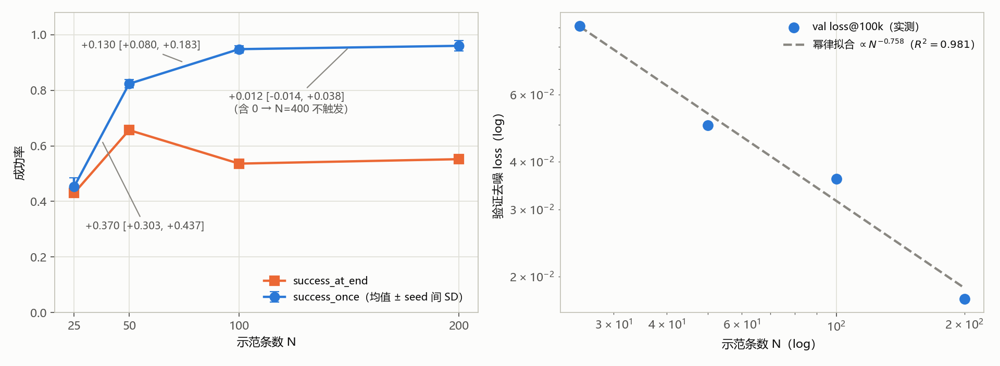
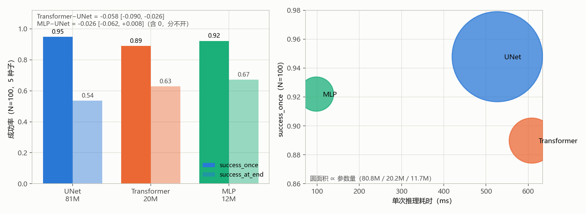
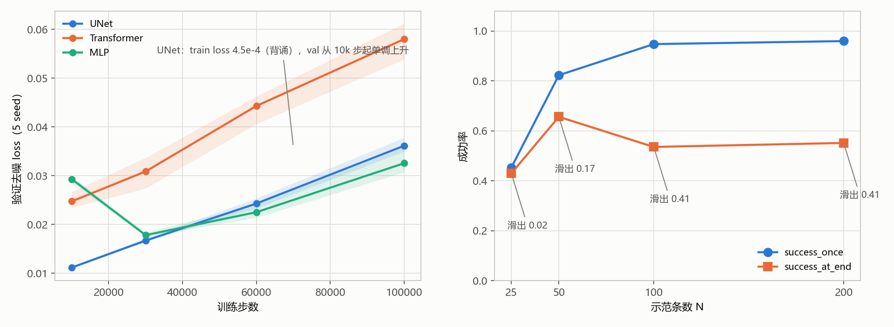

# PushCube：数据量（轨道 A）与主干（轨道 B）正式结果

作者：王博文（学号【待补】）

负责任务：Task 3 / `TASK=pushcube`。本文只报告**测试种子**（10000–10099，100 回合）上的
闭环成功率，checkpoint 一律取 `final.pt`（100k 步）。

## 0. 摘要（TL;DR）

1. **数据量**：UNet 的成功率随示范条数单调上升，**45.3% → 82.3% → 94.8% → 96.0%**
   （N = 25 / 50 / 100 / 200）。25→50（+0.370 [+0.303, +0.437]）与 50→100
   （+0.130 [+0.080, +0.183]）的 bootstrap 区间不含 0；**100→200 = +0.012 [-0.014, +0.038]**
   区间含 0 → **N=100 已平台，按预注册规则 N=400 不触发**。
2. **主干**：在同样的 N=100 上，**UNet 0.948 ± 0.012**、**MLP 0.922 ± 0.019**、
   **Transformer 0.890 ± 0.006**。配对 bootstrap：Transformer−UNet = **-0.058 [-0.090, -0.026]**
   （显著更差）；MLP−UNet = -0.026 [-0.062, +0.008]（区间含 0，与 UNet 分不开）。
3. **效率**：MLP 以 **11.7M 参数量**（UNet 80.8M 的 1/7）、**98 ms 单次推理**
   （UNet 527 ms 的 1/5.4）拿到与 UNet 分不开的成功率。
4. **成功 ≠ 保持**：`success_at_end` 排序恰好相反（MLP 0.672 > Transformer 0.628 >
   UNet 0.536）——UNet 进目标区最多、滑出也最多（UNet N=100 平均 41/100 回合进过目标区
   但结束时滑出，MLP 只 25/100）。
5. **双重信号**：成功率已平台，验证 loss 仍按 **∝ N^−0.758 的幂律下降**（R²=0.981，
   100→200 再降一半）。
6. **与 PickCube 对照**：UNet 同款过拟合，简单任务上无害、难任务上致命。

## 1. 实验设置

| 项目 | 值 |
| --- | --- |
| 任务 | `pushcube` / `PushCube-v1`，控制模式 `pd_ee_delta_pos`（4 维动作） |
| 回合长度 | 100 步（`configs/tasks/pushcube.toml`） |
| 仿真后端 | `physx_cpu`（与示范数据一致） |
| 观测 | RGB 128×128×3（ResNet-18，feature 128）+ 非特权 proprioception |
| 数据 | 官方 demogen 训练示范池 400 条（种子 0–3999，取前 N 条，嵌套 25⊂50⊂100⊂200）；验证示范 50 条（4000+） |
| 训练预算 | 100k optimizer steps，batch 64，AdamW lr 1e-4 + betas(0.95, 0.999)，cosine + 500 warmup，AMP，DDPM 100 步，EMA |
| 训练种子 | N=25/50 用 1–3；N=100/200 与三个主干用 1–5 |
| 评估 | `SPLIT=test`，回合 10000–10099，`NUM_ENVS=4`，`CHECKPOINT=final.pt` |
| 数据根 | `/userhome/cs5/u3684254/maniskill-demogen/data/dataset`（只读） |
| 运行根 | `/userhome/cs5/u3684254/dp-manip/runs` |
| 代码 | `~/dp-manip`，commit `646117eb3f7538f814922c62a2729373919d424d`（分支 `main`，`dirty=false`） |

轨道 B 的自变量只有 `policy.backbone`（Gate B 已核对，见 §2）。参数量为含共享
ResNet-18 编码器的总策略参数量（裸 UNet 主干为官方 66.4M ConditionalUnet1D），
容量差约 7 倍，结论只能限定为「在这三个具体实现之间」。

### 1.1 交接信息（对应 `instructions.md` §13）

| 项目 | 值 |
| --- | --- |
| `TASK` | `pushcube`（Task 3） |
| Git commit | `646117eb3f7538f814922c62a2729373919d424d`（分支 `main`） |
| `DATA_ROOT` | `/userhome/cs5/u3684254/maniskill-demogen/data/dataset` |
| `RUN_ROOT` | `/userhome/cs5/u3684254/dp-manip/runs` |
| 训练作业 | data_size = **135573**；backbone = **135625 → 135661 → 135664**（三次接力补齐） |
| 评估作业 | final = **135621**；诊断 10k/30k/60k = **135622 / 135623 / 135624**；backbone = **135681** |
| 顶层汇总 | 全部作业 `failed: 0 interrupted: 0`；data_size `16/16 completed`，backbone `10 新格 + 5 复用` |
| Gate B 输出 | `data_size: 16 cells ok, control_hash=cf9defc88f09`；`backbone: 15 cells ok, control_hash=bf998cb5b6bd`（5 个 UNet N=100 复用轨道 A） |
| 文件齐全性 | `summary.json` / `final.pt` / `eval/test_final.json` 均为 **26/26** |
| 人工干预 / 异常 | backbone 训练由三次作业接力补齐（135625 → 135661 → 135664），无 failed、无 requeue |

## 2. 验收与完整性

| 检查 | 结果 |
| --- | --- |
| data-size 训练作业 135573 | `completed: 16 skipped: 0 failed: 0 interrupted: 0` |
| backbone 训练作业 135625+135661+135664 | 10 个新格全部完成（5 个 UNet N=100 复用轨道 A） |
| data-size 评估作业 135621 | `completed: 16 skipped: 0 failed: 0 interrupted: 0` |
| backbone 评估作业 135681 | `completed: 10 skipped: 0 failed: 0 interrupted: 0` |
| Gate B（data_size） | `16 cells ok, control_hash=cf9defc88f09` |
| Gate B（backbone） | `15 cells ok, control_hash=bf998cb5b6bd` |
| 文件计数 | `summary.json` 26 / `checkpoints/final.pt` 26 / `eval/test_final.json` 26 |

三种计数的期望值都是 26（16 个 UNet + 5 个 Transformer + 5 个 MLP），实测一致。

## 3. 轨道 A：数据量（UNet）

### 3.1 汇总

| N | seed 数 | `success_once` 均值 ± SD | `success_at_end` 均值 | `return` 均值 | val@100k |
| --- | --- | --- | --- | --- | --- |
| 25 | 3 | 0.453 ± 0.026 | 0.430 | 15.2 | 0.0907 |
| 50 | 3 | 0.823 ± 0.012 | 0.657 | 27.7 | 0.0499 |
| 100 | 5 | 0.948 ± 0.012 | 0.536 | 30.7 | 0.0361 |
| 200 | 5 | **0.960 ± 0.017** | 0.552 | 31.0 | **0.0175** |

相邻两档的差值用两层 bootstrap（重采样 seed + 重采样回合，10000 次，RNG seed=0）：

```text
50 − 25   = +0.370   95% CI [+0.303, +0.437]
100 − 50  = +0.130   95% CI [+0.080, +0.183]   （显著，但下限只有 +0.080）
200 − 100 = +0.012   95% CI [-0.014, +0.038]   （含 0 → N=100 已平台，N=400 按预注册规则不触发）
```

| 指标 | 拟合 | R² | 含义 |
| --- | --- | --- | --- |
| `success_once` | 100→200 仅 +0.012（CI 含 0） | — | 已平台 |
| val_loss（4 档） | ∝ N^−0.758 | 0.981 | 100→200 仍降一半，未饱和 |

成功率与验证 loss 给出相反的信号：成功率已平台，验证 loss 仍按 ∝ N^−0.758 下降
（R²=0.981），100→200 仍降一半。



*图 1（`figures/fig1_datasize_pushcube.png`）：左 = UNet 的 `success_once`（带 seed 间 SD 误差棒）与
`success_at_end` 随 N 的变化，标注了 25→50、50→100、100→200 的 bootstrap 差值；右 = 四档的
验证去噪 loss（log-log），虚线是 N^−0.758 的幂律拟合（R²=0.981）。*

### 3.2 逐 run

| run | `success_once` | `success_at_end` |
| --- | --- | --- |
| `unet_n25_s1` / `s2` / `s3` | 0.49 / 0.43 / 0.44 | 0.45 / 0.41 / 0.43 |
| `unet_n50_s1` / `s2` / `s3` | 0.82 / 0.81 / 0.84 | 0.66 / 0.64 / 0.67 |
| `unet_n100_s1` … `s5` | 0.96 / 0.96 / 0.94 / 0.95 / 0.93 | 0.53 / 0.57 / 0.49 / 0.57 / 0.52 |
| `unet_n200_s1` … `s5` | 0.94 / 0.97 / 0.97 / 0.98 / 0.94 | 0.54 / 0.53 / 0.57 / 0.55 / 0.57 |

单 run 100 回合的 Wilson 半宽 ±0.045–0.096，单点数字带区间；均值用 seed 间 SD。

## 4. 轨道 B：主干（N=100）

| 主干 | `success_once` 均值 ± SD | `success_at_end` 均值 | `return` 均值 |
| --- | --- | --- | --- |
| **UNet (B0)** | **0.948 ± 0.012** | 0.536 | 30.7 |
| MLP (B2) | 0.922 ± 0.019 | **0.672** | 29.9 |
| Transformer (B1) | 0.890 ± 0.006 | 0.628 | 31.0 |

逐 run：

| run | `success_once` | `success_at_end` |
| --- | --- | --- |
| `transformer_n100_s1` … `s5` | 0.89 / 0.90 / 0.88 / 0.89 / 0.89 | 0.63 / 0.66 / 0.57 / 0.60 / 0.68 |
| `mlp_n100_s1` … `s5` | 0.95 / 0.92 / 0.92 / 0.89 / 0.93 | 0.65 / 0.60 / 0.68 / 0.74 / 0.69 |

与 B0 的配对 bootstrap（同一批训练/测试口径，重采样 seed + 回合，10000 次）：

```text
Transformer − UNet = -0.058   95% CI [-0.090, -0.026]   （显著更差）
MLP         − UNet = -0.026   95% CI [-0.062, +0.008]   （区间含 0，分不开）
MLP   − Transformer = +0.032   95% CI [-0.002, +0.066]  （临界）
```



*图 2（`figures/fig2_backbone_pushcube.png`）：左 = N=100 上三主干的 `success_once` / `success_at_end`
（浅色柱为 at_end，误差来自 5 seed），顶部标注 Transformer−UNet 与 MLP−UNet 的 bootstrap 差值；
右 = 成功率–单次推理耗时散点，圆面积正比于参数量。MLP 落在"又快又接近"的左上角，
UNet 成功率高但推理最慢。*

## 5. 效率指标（同一型号 GPU：RTX 4080 SUPER）

| 主干 | 参数量 | 训练 100k 步（5 seed 均值） | 峰值显存 | 单次推理 |
| --- | --- | --- | --- | --- |
| UNet | 80.8M（主干 66.4M） | 1.79 ± 0.01 h | 2,706 MB | 527 ms |
| Transformer | 20.2M | 1.77 ± 0.04 h | 1,506 MB | 608 ms |
| MLP | **11.7M** | **1.65 ± 0.19 h** | **1,278 MB** | **98 ms** |

MLP 参数量为 UNet 的 1/7、推理快 5.4 倍——单 run 100 回合共 325 次策略调用，
UNet 约 171 s、MLP 约 32 s。

## 6. 关键发现：任务难度决定背诵的后果

| 主干 | train_loss@100k | val@10k | val@30k | val@60k | val@100k |
| --- | --- | --- | --- | --- | --- |
| UNet | **4.5e-4** | 0.011 | 0.017 | 0.024 | **0.036** |
| Transformer | 1.79e-2 | 0.025 | 0.031 | 0.044 | 0.058 |
| MLP | 4.1e-3 | 0.029 | 0.018 | 0.023 | 0.033 |

1. UNet 把训练集背到近零（train loss ≈ 4.5e-4）、验证 loss 从 10k 步起一路上升，与
   PickCube 上是同一套过拟合签名。但 PickCube 上 UNet 因此成为最差主干
   （0.192，Transformer 0.906 / MLP 0.796），PushCube 上 UNet 仍是成功率最高主干。
   任务难度决定背诵的后果。
2. val@100k 的排序（MLP 0.033 < UNet 0.036 < Transformer 0.058）与 `success_once`
   的排序不一致；同主干内（§3.1）val 排序才与成功率一致。
3. Transformer 的 train loss 未收敛到背诵水平（1.79e-2），是三个主干中唯一欠拟合的，
   与其成功率垫底对应。



*图 3（`figures/fig3_training_pushcube.png`）：左 = N=100 三主干的验证去噪 loss 随训练步变化
（实线为 5 seed 均值，阴影为 seed 间范围），UNet 从 10k 步起单调上升；右 = 各 N 档的
`success_once` / `success_at_end`，底部标注两者之差（"进过目标区又滑出"的回合数 /100）。*

## 7. 局限性与效度威胁

1. **容量不对齐**：80.8M : 20.2M : 11.7M，约 7 倍，结论只在这三个具体实现之间。
2. **固定 100k 步口径**：N=25 的最优泛化点在 10k 步附近（10k 时 0.593 → final 0.453），
   `final.pt` 对最小数据档系统性低估。
3. **N < 100 只测了 UNet**：低数据量下主干排序未知。
4. **单任务、简单任务**：N=100 即平台，与 PickCube 结论方向相反，两个任务分开叙事。
5. **评测统计精度**：单 run 100 回合 Wilson 半宽 ±0.045–0.096；`success_once` 与
   `success_at_end` 不能混用（UNet N=100 平均 41/100 回合「进过目标区但结束时滑出」，
   MLP 只 25/100）。

## 8. 结论

1. PushCube 上 UNet 的成功率随演示数据量单调上升（45.3% → 82.3% → 94.8% → 96.0%），
   N=100 平台（100→200 的 bootstrap 区间含 0），按预注册规则 N=400 不触发。
2. 同数据同预算下，`success_once` 排序 UNet 0.948 ≥ MLP 0.922 > Transformer 0.890；
   MLP 与 UNet 分不开（CI 含 0），而参数量 1/7、推理快 5.4 倍、显存省一半。
3. 机制与 PickCube 同源：UNet 同一套过拟合签名（train ≈ 4.5e-4、val loss 一路上升），
   任务难度决定背诵的后果——简单任务上无害、难任务上致命。
4. `success_at_end` 排序相反（MLP 0.672 > Transformer 0.628 > UNet 0.536）：UNet 进
   目标区最多、滑出也最多（41/100），MLP 保持最好（25/100）。
5. 结论限定为「这三个具体实现之间」，并同时给出参数量与耗时；数据量结论只覆盖 UNet；
   固定 100k 步口径对最小数据档系统性低估；成功率与验证 loss 的双重信号（§3.1）。

## 附录 A：复现命令

```bash
cd ~/dp-manip
export TASK=pushcube
export DATA_ROOT="$HOME/maniskill-demogen/data/dataset"
export RUN_ROOT="$HOME/dp-manip/runs"

# 1) 训练轨道 A（16 run）
sbatch --open-mode=append \
  --export=ALL,TASK="$TASK",EXPERIMENT=configs/experiments/data_size.toml,DATA_ROOT="$DATA_ROOT",RUN_ROOT="$RUN_ROOT" \
  slurm/train_dual_gpu.sbatch

# 2) 训练轨道 B（新增 10 run，UNet N=100 复用）
sbatch --open-mode=append \
  --export=ALL,TASK="$TASK",EXPERIMENT=configs/experiments/backbone.toml,DATA_ROOT="$DATA_ROOT",RUN_ROOT="$RUN_ROOT" \
  slurm/train_dual_gpu.sbatch

# 3) 闭环评估（final.pt，逐次提交）
sbatch --open-mode=append \
  --export=ALL,TASK="$TASK",EXPERIMENT=configs/experiments/data_size.toml,RUN_ROOT="$RUN_ROOT",CHECKPOINT=final.pt,SPLIT=test,NUM_ENVS=4 \
  slurm/eval_dual_gpu.sbatch
sbatch --open-mode=append \
  --export=ALL,TASK="$TASK",EXPERIMENT=configs/experiments/backbone.toml,RUN_ROOT="$RUN_ROOT",CHECKPOINT=final.pt,SPLIT=test,NUM_ENVS=4 \
  slurm/eval_dual_gpu.sbatch

# 4) 验收
.venv/bin/python scripts/sweep.py plan --experiment configs/experiments/data_size.toml \
  --task "$TASK" --data-root "$DATA_ROOT" --output-root "$RUN_ROOT"
.venv/bin/python scripts/check_experiment.py --experiment data_size \
  --task "$TASK" --data-root "$DATA_ROOT" --run-root "$RUN_ROOT"
.venv/bin/python scripts/check_experiment.py --experiment backbone \
  --task "$TASK" --data-root "$DATA_ROOT" --run-root "$RUN_ROOT"
```

条件档（N=400）按 §3.1 的预注册规则不触发，未使用。

## 附录 B：文件清单与计数

| 路径 | 数量 | 说明 |
| --- | --- | --- |
| `$RUN_ROOT/<run>/checkpoints/final.pt` | 26 | 正式结果使用的 checkpoint |
| `$RUN_ROOT/<run>/summary.json` | 26 | final step、最终 loss、耗时、峰值显存 |
| `$RUN_ROOT/<run>/eval/test_final.json` | 26 | 100 回合逐回合结果 + 汇总 |
| `report/figures/fig{1,2,3}_*_pushcube.png` | 3 | 本文插图（由 eval JSON / `metrics.jsonl` 汇总绘制） |

## 附录 C：机时统计

每个 run 占一张卡，按各 run 墙钟（summary.json）累加：

| 作业 | run 数 | GPU-min |
| --- | --- | --- |
| 训练 data_size（135573） | 16 | 1,680 |
| 训练 backbone（135625/135661/135664） | 10 | 1,027 |
| 评估（74 次） | 74 | 216 |
| **合计** | 26 run + 74 eval | **≈ 2,922 GPU-min（48.7 GPU-h）** |

参考：单 run 训练约 107 GPU-min，评估约 3.4 min。
